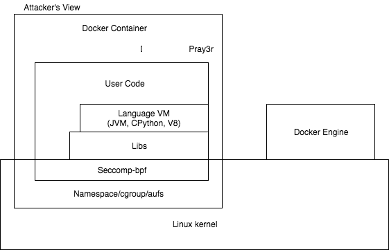
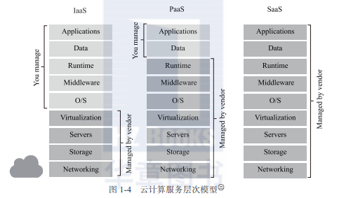

# 调研报告

## 小组成员

- 钟书锐
- 李思逸
- 赵辰阳
- 谢新格
- 胡乐翔

## 项目简介

在云计算应用场景中，以Docker为代表的传统容器在遇到多租户场景时，它的安全问题立刻暴露了出来。
为此，先有kata container 提出安全容器的概念，用虚拟机弥补容器隔离的不足。然而其虚拟机过于重量级的问题，使得AWS对应推出了Firecracker microVM的方案，使得效率和资源消耗都有明显改善。而后有Google 提出的gVisor解决方案， 在容器的后端将所有的系统调用截断，凭借gVisor中用户程序来实现系统调用的API。 gVisor极其轻量，隔离性却也达到了操作系统能带来的隔离程度 。

两种思路都有各自的缺点，firecracker本质上还是传统的虚拟机架构，不可避免地带来多层嵌套的性能损耗。而gVisor 一是面临着隔离性不足的原生容器缺陷，二是面临着过多系统调用时无法忍受的上下文转换。

我们试图利用Firecracker基于KVM和virIO的架构，可以获得优异的封装和性能提升，同时希望借鉴gVisor系统调用截断的方式，使其与unikernel进行交互，取代gVisor中sentry+gofer 的类内核架构，也达到了轻量高效的目的。

Firecracker使用rust语言实现，基于rust-vmm开源项目。而gVisor使用go语言实现，我们同时会改写一部分代码为rust，以期取得更高的效率和更安全稳定的内核。

## 立项依据

gVisor 具有一下两个问题，使之难以真正用于生产环境：

- gVisor 目前主要通过 Linux ptrace 系统调用实现，在系统调用监控的过程中，必然会出现一次上下文转换（Context Switch），这 gVisor 虽然保证了系统的安全，但是也造成了性能问题，gVisor 的性能与实际生产环境的要求还有较大差距。
- gVisor 作为一个操作系统内核，采用带有 GC 的 Go 语言编写。虽然 Go 语言的安全性确实保障了容器的安全，但现在绝大多数可用的操作系统内核都采用无 GC 的语言编写，用 Go 编写内核会有比较大的性能开销。

Firecracker不支持kubernetes, Docker的环境， 这就给其推广造成一定阻碍，但是gVisor支持上述环境

我们为了改进以上问题，我们试图利用Firecracker基于KVM和virIO的架构，可以获得优异的封装和性能提升，同时希望借鉴gVisor系统调用截断的方式，使其与unikernel进行交互，取代gVisor中sentry+gofer 的类内核架构，也达到了轻量高效的目的。

Firecracker使用rust语言实现，基于rust-vmm开源项目。而gVisor使用go语言实现，我们会改写一部分代码为rust，以期取得更高的效率和更安全稳定的内核。

## 重要性与前瞻性分析

### 安全容器

原本基于 KVM+QEMU 的传统虚拟化方法可以提供很好的隔离型，但是虚拟机整体而言不够轻量。而以 Docker 为代表的传统容器技术，实现了轻量、无痛的容器隔离，但随着容器技术的不断发展，传统容器隔离性不足的缺点逐渐暴露出来。

Docker 的架构大体如下，由 Linux Kernel、Namespace/Cgroups/Aufs、Seccomp-bpf、Libs、Language VM、User Code、Container(Docker) engine 这几个部件组成。

从攻击者的角度，这个架构比较复杂，因而暴露出的漏洞也比较多，攻击者既可以利用 Linux 内核进行攻击，又可以通过利用 Docker 容器自身的漏洞进行攻击，很容易实现容器逃逸。

为了提高容器的安全性，增强容器之间的隔离，安全容器的技术开始逐步出现：

- Kata 基于传统的容器技术，将传统容器采用比较轻量的方法实现，利用它自身优化和性能设计，也拥有与容器相媲美的敏捷性。
- gVisor 采用沙箱技术，它主要实现了大部分的system call。它运行在应用程序和内核之间，为它们提供隔离。

### Unikernel

Unikernel，在我看来，是另一种形式上的容器。在一个 Unikernel 中，只能运行一个应用，这与容器的哲学不谋而合。但现在容器最吸引人的特性并不是它的便捷，而是在它的分发。Docker 让我们看到了，原来应用的分发可以这么无痛。而 Unikernel 与容器相比，虽然可以做的更小更安全，而且也不需要有 Docker Daemon 这样的后台程序存在，甚至不需要 Host OS，或者 Hypervisor，但是它一是与传统的软件过程有较大的出入，二是在分发等等方面不能做到像容器那样方便。所以它目前肯定不会成为主流的应用分发方式，还需要进一步探索。 

unikernel 是容器技术发展的必然产物，小、简单、安全、高效，当你看到云客户端时就像看到单应用硬件一样，那就是 Unikernel试图解决的：删除应用与硬件中间臃肿的部分，从而让最“精简”的操作系统运行你的代码。

### Rust 语言

虽然 Rust 是一种通用的多范式语言，但它的目标是 C 和 C++占主导地位的系统编程领域。这意味着你可以使用 Rust 编写操作系统、游戏引擎和许多性能关键型应用程序。同时，它还具有足够的表现力，你可以使用它构建高性能的 Web 应用程序、网络服务，类型安全的数据库对象关系映射（Object Relational Mapping，ORM）库，还可以将程序编译成WebAssembly 在 Web 浏览器上运行。Rust 还在为嵌入式平台构建安全性优先的实时应用程序方面获得了相当大的关注，例如 Arm 基于 Cortex-M 的微控制器，目前该领域主要由 C语言主导。Rust 因其广泛的适用性在多个领域都表现良好，这在单一编程语言中是非常罕见的。

强类型属性使 Rust 可以安全地重构代码，并在编译时捕获大多数错误，而不是在运行时出错。用 Rust 编写的程序表现力和性能都非常好，因为使用它你可以拥有高级函数式语言的大部分特性，例如高阶函数和惰性迭代器，这些特性使你可以编译像 C/C++程序这样高效的程序。它的很多设计决策中强调的首要理念是编译期内存安全、零成本抽象和支持高并发。让我们来详细说明这些理念。

## 项目背景

### kata
kata containers是由OpenStack基金会管理，但独立于OpenStack项目之外的容器项目。它是一个可 以使用容器镜像以超轻量级虚机的形式创建容器的运行时工具。 

Kata containers其实跟RunC类似，也是一个符合OCI运行时规范的一种 实现（即Clear Container和runV 都符合OCI规范），不同之处是，它给每个容器（在Docker容器的 角度）或每个Pod（k8s的角度）增加了一个独立的linux内核（不共享宿主机的内核），使容器有更好 的隔离性，安全性。

详细情况参考GitHub上[KATA](https://github.com/kata-containers/kata-containers)介绍。

### gVisor

据gVisor项目的GitHub [README](https://github.com/google/gvisor/blob/master/README.md)介绍，gVisor是一个作为普通非特权进程运行的内核，支持大多数的Linux系统调用。就像在VM中一样，在gVisor沙箱中运行的应用程序有自己的内核和虚拟设备，与主机和其它沙箱区分开来。通过拦截应用程序[系统调用](https://en.wikipedia.org/wiki/System_call)并作为客户内核运行，gVisor提供了强隔离边界，可以将其视为极致[半虚拟化的操作系统](https://en.wikipedia.org/wiki/Paravirtualization)，“与完整的VM相比，资源占用更灵活，固定成本更低”。不过，这种灵活性牺牲了性能和兼容性：对于频繁进行系统调用的工作负载，gVisor的性能可能会差一些；虽然gVisor 实现了Linux系统API的一大部分（目前200个系统调用），但有几个系统调用和参数还不支持（/proc和/sys文件系统的某些部分），也就是说，[并不是所有的应用程序都可以在gVisor内运行](https://github.com/google/gvisor#user-content-what-doesnt-work-yet)。 

### kata vs gvisor
gVisor 工作的核心，在于它为应用进程、也就是用户容器，启动了一个名叫 Sentry 的进程。 而 Sentry 进程的主要职责，就是提供一个传统的操作系统内核的能力，即：运行用户程序，执行系统调用。所以说，Sentry 并不是使用 Go 语言重新实现了一个完整的 Linux 内核，而只是一个对应用进程“冒充”内核的系统组件。

可以参考这篇[gVisor 和 KataContainers](https://blog.csdn.net/cr7258/article/details/114297167)

### unikernel

Unikernel使用户可以从一个服务库中选择应用需要的操作系统服务而无须整个操作系统，用户选择的服务则会成为应用的一部分。

Unikernel 是与某种语言紧密相关的，一种 unikernel 只能用一种语言写程序，这个LibraryOS 加上你自己写的程序最终被编译成成一个操作系统，这个操作系统只跑你的程序，里面也只有你这一个程序，没有其它冗余的程序，没有多进程切换，所以系统很小也很简单。

虽然 docker 容器的 image 比传统的虚拟机(以G计)要小很多，但是一般也是好几百兆，而 unikernel 由于不包含其它不必要的程序(ls,echo,cd,tar等)，体积非常小，通常只有几兆甚至可以更小。比如 mirageOS 的示例 mirage-skeleton 编译出来的 xen 虚拟机只有 2M。

Unikernel在整个服务器的架构中取消了操作系统，应用直接运行在hypervisor或者硬件上。试图抹去现代操作系统带来的一些复杂性。因为“通用”的操作系统（就像任何Linux和Windows的发行版），通常会伴随着带来一些对你的应用来说并不需要的驱动、依赖包、服务、等等。

**这就使得它获得了下面几个优势：**

**大小**

对比虚拟机或者容器，unikernel只需要运行应用所必须的服务，因此应用可以减小很多。甚至是在Linux内核的核心模块都并不是需要每一次都完全加载。像USB驱动这类东西在虚拟化的“云”环境是无用的，均可以去除。这意味着应用若需要部署到不同的服务器上将会变得方便一些，省下的不光是时间，如果云计算提供商对流量收费的话，还有真金白银。

**速度**

Unikernel快得就剩一个快字了。最快的unikernel启动只需要20毫秒。这意味着unikernel甚至可以在用户请求时才启动并对用户请求做出响应。MirageOS正开发一个叫做Jitsu的的工具来帮助用户在云计算环境中快速启动和关闭unikernel。

**安全**

确保系统安全的一个方法是对其进行简化，这样就减小了出现漏洞受到攻击的可能性。对于unikernel来说可攻击的面非常小，这就使它有了很高的安全性。没有其它不必要的程序，使其受到漏洞攻击的可能性大大降低，docker 里面虽然大多数情况只跑一个程序，但是里面含有其它 coreutils，只要其中任何一个有安全漏洞，整个服务可能就会受到攻击。没有多进程任务切换，CPU可以非常高效地运行。

**兼容性**

虽然unikernel需要应用在设计时就考虑到使用unikernel来部署。然而已经出现了Rump Kernels这样的工具可以将一般的应用以unikernel的方式来运行。

上面所列举的四个优势完全符合微服务的发展趋势。Docker和CoreOS已经在很大程度上改变了我们消费基础设施的方式然而它们能否适应unikernel的崛起还未可知。

今后五年unikernel有可能完全取代容器技术，就算不能取代它也会成为容器技术的强力补充,值得关注

### AWS Firecracker 

- 基于内核的虚拟机（Kernel-based Virtual Machine，简称 KVM）是在 Linux 内核中运行并将内核视为其管理程序的 VM。可以同时运行多个 KVM，并且像典型的 VM 一样，每个 KVM 都有自己的虚拟化硬件。
  Firecracker 的每个实例被称为 microVM。

- Firecracker 的安全性：

  - 一个简单的 guest 模型，允许 Firecracker 用户访问 KVM 的最小元素：“网络设备，块 I/O 设备，可编程间隔定时器，KVM 时钟，串行控制台和仅有一个按键的键盘控制器，用于停止 microVM"。
  - Firecracker 通过使用 seccomp BPF 和控制组而被监禁。 此外，它只能访问有限的系统调用列表。
  - Firecracker 进程是静态链接的，这意味着它需要运行的所有库都包含在可执行的代码中。 这通过消除外部库使新的 Firecracker 环境更安全。

-  Firecracker microVM 仅使用大约 5 MiB，也就是 5.24 MB 的内存。这意味着可以在单个虚拟 CPU 上运行数千个 Firecracker microVM。 

- Firecracker 非常简单

  Firecracker microVMs 包含的内容并不多，只有 Virtio 网络驱动程序，Virtio 块驱动程序，可编程间隔计时器，KVM 时钟，串行控制台和单按键键盘。

  Firecracker 不是一个完整的设备模型，它没有任何模拟的 BIOS，但这减少了潜在的攻击面。正因为功能很少，它的速度也很快。

- 缺点
  Firecracker 不支持 Kubernetes，Docker 或非 Intel 的芯片

  Firecracker 有一些缺点，特别是对于那些使用 AMD 或 ARM 系统的人：这两种芯片组都还没有支持 Firecracker，尽管 AWS 表示将在 2019 年支持这两者。

  Kubernetes 或 Docker 都不受支持，但 AWS 正在开发类似的东西：它的“containerd”容器运行时有一些原型代码能允许它像 Firecracker microVM 一样管理容器。随着进一步的发展，Firecracker 也可能会支持 Docker 和 Kubernetes。

#### 云计算的几种服务模型

“云计算是推动IT转向以业务为中心模式的一次重大变革。它着眼于运营效率、竞争力和快速响应等实际成果。这意味着IT的作用正在从提供IT服务逐步过渡到根据业务需求优化服务的交付和使用。这种全新的模式将以前的信息孤岛转化为灵活高效的资源池和具备自我管理能力的虚拟基础架构，从而以更低的成本和以服务的形式提供给用户。IT即服务将提供业务所需要的一切，并在不丧失对系统的控制力的同时，保持系统的灵活性和敏捷性。”

云计算的模型是以服务为导向的，根据提供的服务层次不同，可分为：IaaS（Infrastructure as a Service，基础架构即服务）、PaaS（Platform as a Service，平台即服务）、SaaS（Software as a Service，软件即服务）。它们提供的服务越来越抽象，用户实际控制的范围也越来越小，如图1-4所示。

**1. SaaS，软件即服务**云服务提供商提供给客户直接使用软件服务，如Google Docs、Microsoft CRM、Salesforce.com等。用户不必自己维护软件本身，只管使用软件提供的服务。用户为该软件提供的服务付费。

**2. PaaS，平台即服务**云服务提供商提供给客户开发、运维应用程序的运行环境，用户负责维护自己的应用程序，但并不掌控操作系统、硬件以及运作的网络基础架构。如Google App Engine等。平台是指应用程序运行环境（图1-4中的Runtime）。通常，这类用户在云环境中运维的应用程序会再提供软件服务给他的下级客户。用户为自己的程序的运行环境付费。

**3. IaaS，基础设施即服务**用户有更大的自主权，能控制自己的操作系统、网络连接（虚拟的）、硬件（虚拟的）环境等，云服务提供商提供的是一个虚拟的主机环境。如Google Compute Engine、AWS EC2等。用户为一个主机环境付费。从图1-4中可以看到，无论是哪种云计算服务模型，虚拟化（Virtualization）都是其基础。那么什么是虚拟化呢？

#### 虚拟化技术

维基百科关于虚拟化的定义是：“In computing, virtualization refers to the act of creating a virtual (rather than actual) version of something, including virtual computer hardware platforms, storage devices, and computer network resources。”（在计算机领域，虚拟化指创建某事物的虚拟（而非实际）版本，包括虚拟的计算机硬件平台、存储设备，以及计算机网络资源）可见，虚拟化是一种资源管理技术，它将计算机的各种实体资源（CPU、内存、存储、网络等）予以抽象和转化出来，并提供分割、重新组合，以达到最大化利用物理资源的目的。

广义来说，我们一直以来对物理硬盘所做的逻辑分区，以及后来的LVM（Logical Volume Manager），都可以纳入虚拟化的范畴。

结合图1-4来看，在没有虚拟化以前（我们抽掉Virtualization层），一个物理的主机（Sever、Storage、Network层）上面只能支持一个操作系统及其之上的一系列运行环境和应用程序；有了虚拟化技术，一个物理主机可以被抽象、分割成多个虚拟的逻辑意义上的主机，向上支撑多个操作系统及其之上的运行环境和应用程序，则其资源可以被最大化地利用。

如图1-5所示的Virtual Machine Monitor（VMM，虚拟机监控器，也称为Hypervisor）层，就是为了达到虚拟化而引入的一个软件层。它向下掌控实际的物理资源（相当于原本的操作系统）；向上呈现给虚拟机N份逻辑的资源。为了做到这一点，就需要将虚拟机对物理资源的访问“偷梁换柱”—截取并重定向，让虚拟机误以为自己是在独享物理资源。虚拟机监控器运行的实际物理环境，称为宿主机；其上虚拟出来的逻辑主机，称为客户机。

虚拟化技术有很多种实现方式，比如软件虚拟化和硬件虚拟化，再比如准虚拟化和全虚拟化。下面将针对每种实现方式做一个简单的介绍。

#### 软件虚拟化和硬件虚拟化

**1.软件虚拟化技术**
软件虚拟化，顾名思义，就是通过软件模拟来实现VMM层，通过纯软件的环境来模拟执行客户机里的指令。

最纯粹的软件虚拟化实现当属QEMU。在没有启用硬件虚拟化辅助的时候，它通过软件的二进制翻译仿真出目标平台呈现给客户机，客户机的每一条目标平台指令都会被QEMU截取，并翻译成宿主机平台的指令，然后交给实际的物理平台执行。由于每一条都需要这么操作一下，其虚拟化性能是比较差的，同时其软件复杂度也大大增加。但好处是可以呈现各种平台给客户机，只要其二进制翻译支持。
**2.硬件虚拟化技术**
硬件虚拟化技术就是指计算机硬件本身提供能力让客户机指令独立执行，而不需要（严格来说是不完全需要）VMM截获重定向。

以x86架构为例，它提供一个略微受限制的硬件运行环境供客户机运行（non-root mode），在绝大多数情况下，客户机在此受限环境中运行与原生系统在非虚拟化环境中运行没有什么两样，不需要像软件虚拟化那样每条指令都先翻译再执行，而VMM运行在root mode，拥有完整的硬件访问控制权限。仅仅在少数必要的时候，某些客户机指令的运行才需要被VMM截获并做相应处理，之后客户机返回并继续在non-root mode中运行。可以想见，硬件虚拟化技术的性能接近于原生系统，并且，极大地简化了VMM的软件设计架构。

Intel从2005年就开始在其x86 CPU中加入硬件虚拟化的支持—Intel Virtualization Technology，简称Intel VT。到目前为止，在所有的Intel CPU中，都可以看到Intel VT的身影。并且，每一代新的CPU中，都会有新的关于硬件虚拟化支持、改进的feature加入。也因如此，Intel x86平台是对虚拟化支持最为成熟的平台，

#### 半虚拟化和全虚拟化

**1.半虚拟化**

通过上一节的描述，大家可以理解，最理想的虚拟化的两个目标如下：
1）客户机完全不知道自己运行在虚拟化环境中，还以为自己运行在原生环境里。
2）完全不需要VMM介入客户机的运行过程。
纯软件的虚拟化可以做到第一个目标，但性能不是很好，而且软件设计的复杂度大大增加。
那么如果放弃第一个目标呢？让客户机意识到自己是运行在虚拟化环境里，并做相应修改以配合VMM，这就是半虚拟化（Para-Virtualization）。一方面，可以提升性能和简化VMM软件复杂度；另一方面，也不需要太依赖硬件虚拟化的支持，从而使得其软件设计（至少是VMM这一侧）可以跨平台且是优雅的。“本质上，准虚拟化弱化了对虚拟机特殊指令的被动截获要求，将其转化成客户机操作系统的主动通知。但是，准虚拟化需要修改客户机操作系统的源代码来实现主动通知。”典型的半虚拟化技术就是virtio，使用virtio需要在宿主机/VMM和客户机里都相应地装上驱动。

**2.全虚拟化**
与半虚拟化相反的，全虚拟化（Full Virtualization）坚持第一个理想化目标：客户机的操作系统完全不需要改动。敏感指令在操作系统和硬件之间被VMM捕捉处理，客户操作系统无须修改，所有软件都能在虚拟机中运行。因此，全虚拟化需要模拟出完整的、和物理平台一模一样的平台给客户机，这在达到了第一个目标的同时也增加了虚拟化层（VMM）的复杂度。
性能上，2005年硬件虚拟化兴起之前，软件实现的全虚拟化完败于VMM和客户机操作系统协同运作的半虚拟化，这种情况一直延续到2006年。之后以Intel VT-x、VT-d为代表的硬件虚拟化技术的兴起，让由硬件虚拟化辅助的全虚拟化全面超过了半虚拟化。但是，以virtio为代表的半虚拟化技术也一直在演进发展，性能上只是略逊于全虚拟化，加之其较少的平台依赖性，依然受到广泛的欢迎。

#### Type1和Type2虚拟化

从软件框架的角度上，根据虚拟化层是直接位于硬件之上还是在一个宿主操作系统之上，将虚拟化划分为Typel和Type2，如图1-6所示。

Type1（类型1）Hypervisor也叫native或bare-metal Hypervisor。这类虚拟化层直接运行在硬件之上，没有所谓的宿主机操作系统。它们直接控制硬件资源以及客户机。典型地如Xen（见1.4.1节）和VMware ESX。

Type2（类型2）Hypervisor运行在一个宿主机操作系统之上，如VMware Workstation；或系统里，如KVM。这类Hypervisor通常就是宿主机操作系统的一个应用程序，像其他应用程序一样受宿主机操作系统的管理。比如VMware Workstation就是运行在Windows或者Linux操作系统上的一个程序而已。客户机是在宿主机操作系统上的一个抽象，通常抽象为进程。

### KVM简介

##### KVM的历史

KVM全称是Kernel-based Virtual Machine，即基于内核的虚拟机，是采用硬件虚拟化技术的全虚拟化解决方案。

KVM最初是由Qumranet公司的Avi Kivity开发的，作为他们的VDI产品的后台虚拟化解决方案。为了简化开发，Avi Kivity并没有选择从底层开始新写一个Hypervisor，而是选择了基于Linux kernel，通过加载模块使Linux kernel本身变成一个Hypervisor。2006年10月，在先后完成了基本功能、动态迁移以及主要的性能优化之后，Qumranet正式对外宣布了KVM的诞生。同月，KVM模块的源代码被正式纳入Linux kernel，成为内核源代码的一部分。作为一个功能和成熟度都逊于Xen的项目，在这么快的时间内被内核社区接纳，主要原因在于：

1）在虚拟化方兴未艾的当时，内核社区急于将虚拟化的支持包含在内，但是Xen取代内核由自身管理系统资源的架构引起了内核开发人员的不满和抵触。
2）Xen诞生于硬件虚拟化技术出现之前，所以它在设计上采用了半虚拟化的方式，这让Xen采用硬件虚拟化技术有了更多的历史包袱，不如KVM新兵上阵一身轻。
2008年9月4日，Redhat公司以1.07亿美元收购了Qumranet公司，包括它的KVM开源项目和开发人员。自此，Redhat开始在其RHEL发行版中集成KVM，逐步取代Xen，并从RHEL7开始，正式不支持Xen。

##### KVM的功能概览

KVM从诞生开始就定位于基于硬件虚拟化支持的全虚拟化实现。它以内核模块的形式加载之后，就将Linux内核变成了一个Hypervisor，但硬件管理等还是通过Linux kernel来完成的，所以它是一个典型的Type 2 Hypervisor，如图1-7所示。

一个KVM客户机对应于一个Linux进程，每个vCPU则是这个进程下的一个线程，还有单独的处理IO的线程，也在一个线程组内。所以，宿主机上各个客户机是由宿主机内核像调度普通进程一样调度的，即可以通过Linux的各种进程调度的手段来实现不同客户机的权限限定、优先级等功能。
客户机所看到的硬件设备是QEMU模拟出来的（不包括VT-d透传的设备，详见6.2节），当客户机对模拟设备进行操作时，由QEMU截获并转换为对实际的物理设备（可能设置都不实际物理地存在）的驱动操作来完成。

下面介绍一些KVM的功能特性。
**1.内存管理**
KVM依赖Linux内核进行内存管理。上面提到，一个KVM客户机就是一个普通的Linux进程，所以，客户机的“物理内存”就是宿主机内核管理的普通进程的虚拟内存。进而，Linux内存管理的机制，如大页、KSM（Kernel Same Page Merge，内核的同页合并）、NUMA（Non-Uniform Memory Arch，非一致性内存架构）、通过mmap的进程间共享内存，统统可以应用到客户机内存管理上。

早期时候，客户机自身内存访问落实到真实的宿主机的物理内存的机制叫影子页表（Shadow Page Table）。KVM Hypervisor为每个客户机准备一份影子页表，与客户机自身页表建立一一对应的关系。客户机自身页表描述的是GVA→GPA的映射关系；影子页表描述的是GPA→HPA的映射关系。当客户机操作自身页表的时候，KVM就相应地更新影子页表。比如，当客户机第一次访问某个物理页的时候，由于Linux给进程的内存通常都是拖延到最后要访问的一刻才实际分配的，所以，此时影子页表中这个页表项是空的，KVM Hypervisor会像处理通常的缺页异常那样，把这个物理页补上，再返回客户机执行的上下文中，由客户机继续完成它的缺页异常。

影子页表的机制是比较拗口，执行的代价也是比较大的。所以，后来，这种靠软件的GVA→GPA→HVA→HPA的转换被硬件逻辑取代了，大大提高了执行效率。这就是Intel的EPT或者AMD的NPT技术，两家的方法类似，都是通过一组可以被硬件识别的数据结构，不用KVM建立并维护额外的影子页表，由硬件自动算出GPA→HPA。现在的KVM默认都打开了EPT/NPT功能。

**2.存储和客户机镜像的格式**
严格来说，这是QEMU的功能特性。

KVM能够使用Linux支持的任何存储来存储虚拟机镜像，包括具有IDE、SCSI和 SATA的本地磁盘，网络附加存储（NAS）（包括NFS和SAMBA/CIFS），或者支持iSCSI和光线通道的SAN。多路径I/O可用于改进存储吞吐量和提供冗余。

由于KVM是Linux内核的一部分，它可以利用所有领先存储供应商都支持的一种成熟且可靠的存储基础架构，它的存储堆栈在生产部署方面具有良好的记录。

KVM还支持全局文件系统（GFS2）等共享文件系统上的虚拟机镜像，以允许客户机镜像在多个宿主机之间共享或使用逻辑卷共享。磁盘镜像支持稀疏文件形式，支持通过仅在虚拟机需要时分配存储空间，而不是提前分配整个存储空间，这就提高了存储利用率。KVM 的原生磁盘格式为QCOW2，它支持快照，允许多级快照、压缩和加密。

**3.实时迁移**
KVM支持实时迁移，这提供了在宿主机之间转移正在运行的客户机而不中断服务的能力。实时迁移对用户是透明的，客户机保持打开，网络连接保持活动，用户应用程序也持续运行，但客户机转移到了一个新的宿主机上。

除了实时迁移，KVM支持将客户机的当前状态（快照，snapshot）保存到磁盘，以允许存储并在以后恢复它。

**4.设备驱动程序**
KVM支持混合虚拟化，其中半虚拟化的驱动程序安装在客户机操作系统中，允许虚拟机使用优化的 I/O 接口而不使用模拟的设备，从而为网络和块设备提供高性能的 I/O。

KVM 使用的半虚拟化的驱动程序是IBM和Redhat联合Linux社区开发的VirtIO标准；它是一个与Hypervisor独立的、构建设备驱动程序的接口，允许多种Hypervisor使用一组相同的设备驱动程序，能够实现更好的对客户机的互操作性。

同时，KVM也支持Intel的VT-d 技术，通过将宿主机的PCI总线上的设备透传（pass-through）给客户机，让客户机可以直接使用原生的驱动程序高效地使用这些设备。这种使用是几乎不需要Hypervisor的介入的。

**5.性能和可伸缩性**
KVM也继承了Linux的性能和可伸缩性。KVM在CPU、内存、网络、磁盘等虚拟化性能上表现出色，大多都在原生系统的95%以上。KVM的伸缩性也非常好，支持拥有多达288个vCPU和4TB RAM的客户机，对于宿主机上可以同时运行的客户机数量，软件上无上限。

这意味着，任何要求非常苛刻的应用程序工作负载都可以运行在KVM虚拟机上。

##### KVM的现状

至本书写作时，KVM已经10周岁了。10年之间，得益于与Linux天然一体以及Redhat的倾力打造，KVM已经成为Openstack用户选择的最主流的Hypervisor（因为KVM是Openstack的默认Hypervisor）。来自Openstack的调查显示，KVM占到87%以上的部署份额，并且（笔者认为）还会继续增大。可以说，KVM已经主宰了公有云部署的Hypervisor市场；而在私有云部署方面，尤其大公司内部私有云部署，还是VMware的地盘，目前受到HyperV的竞争。

功能上，虚拟化发展到今天，各个Hypervisor的主要功能都趋同。KVM作为后起之秀，并且在公有云上广泛部署，其功能的完备性是毋庸置疑的。并且由于其开源性，反而较少一些出于商业目的的限制，比如一篇文章（ftp://public.dhe.ibm.com/linux/pdfs/Clabby_Analytics_-_VMware_v_KVM.pdf）
中比较VMware EXS 与KVM，就是一个例子。

性能上，作为同样开源的Hypervisor，KVM和Xen都很优秀，都能达到原生系统95%以上的效率（CPU、内存、网络、磁盘等benchmark衡量），KVM甚至还略微好过Xen一点点。与微软的Hyper-V相比，KVM似乎略逊于最新的Windows 2016上的HyperV，而好于Windows 2012 R2上的HyperV，但这是微软的一家之言，笔者没有重新测试验证。其他与诸如VMware EXS等的性能比较，网上也可以找到很多，读者可以自行搜索。总的来说，即使各有优劣，虚拟化技术发展到今天已经成熟，KVM也是如此。

#### KVM的展望

经过10年的发展，KVM已经成熟。那么，接下来KVM会怎样进一步发展呢？

1）大规模部署尚有挑战。KVM是Openstack和oVirt选择的默认Hypervisor，因而实际的广泛部署常常是大规模的（large scale, scalability）。这种大规模，一方面指高并发、高密度，即一台宿主机上支持尽可能多的客户机；另一方面，也指大规模的单个客户机，即单个客户机配备尽可能多的vCPU和内存等资源，典型的，这类需求来自高性能计算（HPC）领域。随着硬件尤其是CPU硬件技术的不停发展（物理的processor越来越多），这种虚拟化的大规模方面的需求也在不停地增大，并且这不是简单数量的增加，这种增加会伴随着新的挑战等着KVM开发者去解决，比如热迁移的宕机时间（downtime）就是其中一例。
2）实时性（Realtime）。近几年一个新的趋势就是NFV（Network Functions Virtualization，网络功能的虚拟化），它指将原先物理的网络设备搬到一个个虚拟的客户机上，以便更好地实现软件定义网络的愿景。网络设备对实时性的要求是非常高的；而不巧，NFV的开源平台OPNFV选择了Openstack，尽管Openstack向下支持各种Hypervisor，但如前文所说，KVM是其默认以及主要部署的选择，所以NFV实时性的要求责无旁贷地落到了KVM头上，NFV-KVM项目应运而生，它作为OPNFV的子项目主要解决KVM在实时性方面受到的挑战。
3）安全是永恒的主题/话题。就像网络病毒永远不停地演变推陈出新一样，新时代的IT架构的主体，云/虚拟化，也会一直受到各类恶意攻击的骚扰，从而陷入道高一尺魔高一丈的循环。Hypervisor的开发者、应用者会一直从如何更好地隔离客户机、更少的Hypervisor干预等方面入手，增加虚拟化的安全性。KVM作为Type 2的Hypervisor，天然地与Host OS有关联，安全性方面的话题更引人注目。同时，硬件厂商如Intel，也会从硬件层面不停地推出新的安全方面的功能（feature），KVM从软件方面也要跟上脚步，使能（enable）之。
4）性能调优。如同一句广告词说的：“进无止境”。一方面，新的功能代码的不停引入总会给性能调优开辟新的空间；另一方面，老的功能的实现也许还有更好的方法。还有，新的硬件功能的出现，也是性能调优永恒的动力源泉。

## 参考文献

[容器未来:AWS VS Google](https://zhuanlan.zhihu.com/p/55603422)

[传统容器已死，安全容器将成为云原生标配](https://zhuanlan.zhihu.com/p/99182075)

[Unikernel: 从不入门到入门](https://zhuanlan.zhihu.com/p/29053035)

[关于 AWS 的 Firecracker，技术人应该知道的十件事](https://www.infoq.cn/article/Hzz8XSp1sCIhw_DOZe5M)

[OSH-2020 x-chital](https://github.com/OSH-2020/x-chital/blob/master/docs/research/research.md)

[Firecracker文档](https://firecracker-microvm.github.io/)

[gVisor文档](https://gvisor.dev/docs/)

[带你读《KVM实战:原理、进阶与性能调优》之一：虚拟化简介](https://developer.aliyun.com/article/724394)

[了解以及区分物理机，虚拟机(hypervisor/VMM) 和 容器(Docker)的适用场景](https://blog.csdn.net/baiyan83/article/details/110182411)

[rust-vmm 开源项目](https://github.com/rust-vmm)

[1]舒红梅,谭良.Unikernel的研究及其进展[J].计算机应用研究,2019,36(06):1601-1608.

[2]Pierre Olivier et al. A binary-compatible unikernel[C]. , 2019.

[3]Christine Hall. Kata Project Seeks to Improve Security with Virtualized Containers[J]. SQL Server Pro, 2018, 

[4]OpenStack Foundation; Kata Containers Project Launches to Build Secure Container Infrastructure[J]. Computer Weekly News, 2017,  : 165-.

[5]Serdar Yegulalp. What’s new in Kubernetes 1.20[J]. InfoWorld.com, 2020, 

[6]孔祥文,宋辰萱.基于Kubernetes的私有容器平台研究[J].电子技术与软件工程,2020(17):185-187.

[7]R. Kumar and B. Thangaraju, "Performance Analysis Between RunC and Kata Container Runtime," 2020 IEEE International Conference on Electronics, Computing and Communication Technologies (CONECCT), Bangalore, India, 2020, pp. 1-4, doi: 10.1109/CONECCT50063.2020.9198653.

[8]W. Viktorsson, C. Klein and J. Tordsson, "Security-Performance Trade-offs of Kubernetes Container Runtimes," 2020 28th International Symposium on Modeling, Analysis, and Simulation of Computer and Telecommunication Systems (MASCOTS), Nice, France, 2020, pp. 1-4, doi: 10.1109/MASCOTS50786.2020.9285946.

[9]J. Talbot et al., "A Security Perspective on Unikernels," 2020 International Conference on Cyber Security and Protection of Digital Services (Cyber Security), Dublin, Ireland, 2020, pp. 1-7, doi: 10.1109/CyberSecurity49315.2020.9138883.

[10]T. Goethals, M. Sebrechts, A. Atrey, B. Volckaert and F. De Turck, "Unikernels vs Containers: An In-Depth Benchmarking Study in the Context of Microservice Applications," 2018 IEEE 8th International Symposium on Cloud and Service Computing (SC2), Paris, France, 2018, pp. 1-8, doi: 10.1109/SC2.2018.00008.

[11]M. Yang and M. Huang, "An Microservices-Based Openstack Monitoring Tool," 2019 IEEE 10th International Conference on Software Engineering and Service Science (ICSESS), Beijing, China, 2019, pp. 706-709, doi: 10.1109/ICSESS47205.2019.9040740.

[12]D. Bernstein, "Containers and Cloud: From LXC to Docker to Kubernetes," in IEEE Cloud Computing, vol. 1, no. 3, pp. 81-84, Sept. 2014, doi: 10.1109/MCC.2014.51.

[13]V. Suryanarayana, K. Mylar Balasubramanya and R. Pendse, "Cache isolation and thin provisioning of hypervisor caches," 37th Annual IEEE Conference on Local Computer Networks, Clearwater Beach, FL, USA, 2012, pp. 240-243, doi: 10.1109/LCN.2012.6423618.

[14]E. Kim, K. Lee and C. Yoo, "On the Resource Management of Kubernetes," 2021 International Conference on Information Networking (ICOIN), Jeju Island, Korea (South), 2021, pp. 154-158, doi: 10.1109/ICOIN50884.2021.9333977.